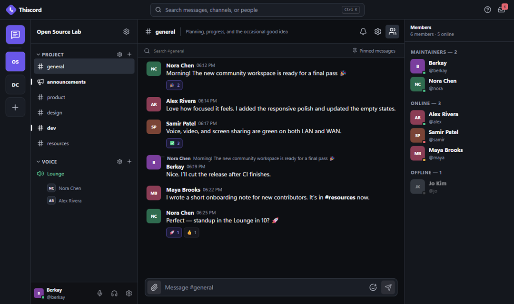

# Thiscord

<p align="center">
  <strong>A self-hosted Discord clone with private community chat, direct messages, and WebRTC voice channels.</strong>
</p>

<p align="center">
  <a href="https://github.com/bgocumlu/thiscord/actions/workflows/ci.yml"></a>
  <a href="https://bgocumlu.github.io/thiscord/"></a>
  
  
  
</p>

<p align="center">
  <a href="https://bgocumlu.github.io/thiscord/"><strong>Open the web app</strong></a>
  ·
  <a href="#run-locally">Run locally</a>
  ·
  <a href="#deploy">Self-host</a>
  ·
  <a href="docs/architecture.md">Architecture</a>
</p>



## What is Thiscord?

Thiscord is a self-hosted Discord clone for communities and teams that want
real-time chat and voice without giving up control of their deployment.
It combines an installable React progressive web app, cross-platform Electron
desktop clients, PocketBase data and authentication, and a private Jitsi WebRTC
media stack.

### Features

- **Community chat:** text and announcement channels, Markdown messages,
  replies, reactions, pins, attachments, presence, and
  notifications.
- **Private conversations:** real-time direct messages with search, reactions,
  read state, and file sharing.
- **Voice channels:** native in-app call surfaces powered by Jitsi, persistent
  calls while navigating, device controls, occupancy, and moderator actions.
- **Roles and permissions:** community roles, channel overrides, invites, bans,
  timeouts, audit events, and server-validated access control.
- **Self-hosted infrastructure:** PocketBase with persistent storage plus a
  Docker Compose Jitsi and TURN stack for WebRTC media.
- **Web and desktop clients:** an installable PWA and Electron packages for
  Windows, macOS, and Linux from one TypeScript codebase.
- **Custom distributions:** replace the name, accent color, icons, domains,
  application ID, protocol, support URL, and update feed for your own
  installation.

## Technology stack

| Layer | Technology |
| --- | --- |
| Web client | React, Vite, TypeScript, TanStack Query, installable PWA |
| Desktop client | Electron with isolated, sandboxed renderer |
| Application backend | PocketBase, SQLite, realtime subscriptions, file storage |
| Voice and video | Jitsi, WebRTC, Prosody, Jicofo, Videobridge, Coturn |
| Deployment | Docker Compose for backend services; static hosting for the frontend |

## Repository overview

Thiscord is a monorepo containing a React PWA, an Electron desktop app,
PocketBase application logic, and a self-hosted Jitsi media stack.

| Part | Runs where |
| --- | --- |
| Web/PWA | GitHub Pages or any static host |
| Desktop | Windows, macOS, and Linux |
| PocketBase | VPS or container host with persistent storage |
| Jitsi + TURN | VPS with public UDP ports |

The frontend and backend have separate lifecycles. Docker is not used for the
frontend.

Voice channels are native Thiscord surfaces backed by the installation’s Jitsi
services. Selecting a disconnected voice channel joins it without replacing the
open conversation. Selecting that connected channel again opens its focused
call view. The call remains active while moving through text channels or direct
messages, with persistent call controls in the sidebar.

## Run locally

Requirements: Node.js 24.10+, npm 11.16, Docker Engine, and Docker Compose v2.

```bash
npm install
docker compose -f compose.local.yml up -d --build
npm run dev:web
```

Open:

- Thiscord: `http://127.0.0.1:5173`
- PocketBase administration: `http://127.0.0.1:8090/_/`
- Jitsi: `http://127.0.0.1:8443`

Create or replace the local PocketBase administrator:

```bash
docker compose -f compose.local.yml exec pocketbase pocketbase superuser upsert admin@example.com "choose-a-long-password" --dir=/app/pb_data
```

Run Electron in another terminal with `npm run dev:desktop`.

Stop everything:

```bash
docker compose -f compose.local.yml down
```

Local data remains in Docker volumes. Add `--volumes` only when you deliberately
want to erase it.

## Deploy

- [Frontend and backend deployment](docs/deployment.md)
- [PocketBase administration](docs/pocketbase.md)
- [Development and tests](docs/development.md)
- [Backups and upgrades](docs/operations.md)
- [Vendored dependencies](docs/vendoring.md)
- [Architecture](docs/architecture.md)
- [Product decisions](docs/product-plan.md)
- [Enhancement backlog](docs/enhancements.md)

The shortest production backend flow is:

```bash
cp .env.example .env
# Edit .env, then:
docker compose config --quiet
docker compose up -d --build
```

The GitHub Pages workflow builds only the static frontend. Store the public
distribution JSON in the `DISTRIBUTION_JSON` repository variable, keep Pages
configured to serve the root of the `gh-pages` branch, and push to `main`.
The same branch can still be published manually. See
[GitHub Pages deployment](docs/github-pages-branch.md).

Create a complete self-host configuration without hand-editing secrets:

```bash
npm run setup:self-host -- \
  --frontend-url https://app.example.com \
  --pocketbase-domain api.example.com \
  --jitsi-domain meet.example.com \
  --turn-domain turn.example.com \
  --public-ip 203.0.113.10 \
  --email admin@example.com \
  --name "Yourcord" \
  --distribution-id yourcord \
  --app-id com.example.yourcord \
  --protocol yourcord
```

This writes `.env` and `infra/distribution.local.json` once and refuses to
overwrite either file. See [Deployment](docs/deployment.md) before exposing the
services publicly.

## Verify changes

```bash
npm run check
npm run build
npm run smoke
npm run smoke:package
docker compose -f compose.local.yml config --quiet
docker compose --env-file .env.example config --quiet
```

The PocketBase API suite is separate because it needs a PocketBase binary. It
verifies permissions and persistence after a real backend restart. See
[Development and tests](docs/development.md) for the command.
